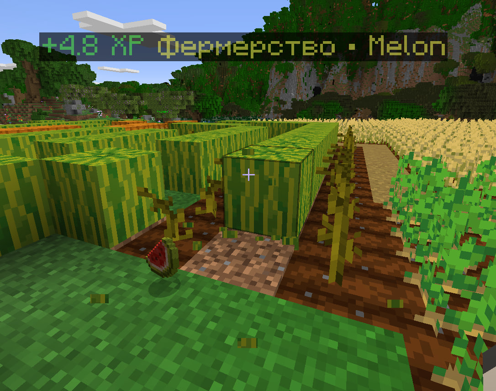

# VisualIndicators

A unified Paper plugin for animated in-world visual feedback.

`VisualIndicators` combines three kinds of feedback into one plugin:

- floating combat damage indicators
- AuraSkills XP indicators
- chat messages above player heads
- built-in shared block breaking progress inspired by MultiMine-style behavior

It is designed for modern Paper/Purpur servers using `TextDisplay` entities and keeps the visual style consistent across all supported indicator types.

## Features

- **Combat damage holograms**
  - animated floating damage numbers
  - stacked damage merging for fast-hit scenarios
  - configurable random offset, scale, lifetime, and upward speed
  - optional entity filtering and disabled worlds list

- **AuraSkills XP holograms**
  - shows XP gain above the relevant source location
  - supports stacked XP labels
  - Russian locale-friendly defaults for skill/source naming
  - AuraSkills is optional and loaded only when present

- **Chat above player heads**
  - ported from a `MessagesOnHead`-style concept into the same visual system
  - configurable line wrapping, duration scaling, gap above head, stacking, background, shadow, and pivot axis
  - follows the speaking player while rising and fading out

- **Built-in MultiMine-style progress logic**
  - shared block break progress tracking
  - optional fade-out of unfinished progress
  - does not require an external MultiMine plugin

- **Operational safety**
  - startup cleanup removes stale frozen `VisualIndicators` combat/chat holograms left after crashes or restarts
  - graceful startup on servers without AuraSkills
  - suitable for mixed networks where some servers only use chat or combat indicators

## Screenshots

### XP hologram



### Combat + XP stacking


### Stacked combat indicators in mob farm


## What inspired this plugin

This plugin was built by combining and adapting ideas from several existing plugins/mods into a single codebase and visual style:

- **AttackIndicator**
  - source inspiration: https://github.com/Eneryleen/Attack-indicator
  - used as the baseline idea for floating combat damage feedback

- **MessagesOnHead**
  - source inspiration: https://github.com/MrQuackDuck/MessagesOnHead
  - used as the basis for the chat-over-head feature and its config model

- **MultiMine**
  - source inspiration: https://github.com/Sideways-Sky/MultiMine
  - used as inspiration for persistent/shared block-breaking progress behavior

## Compatibility

- **Server software**
  - Paper / Purpur 1.20.6 API target

- **Java**
  - Java 21

- **Optional integrations**
  - AuraSkills API `2.3.9` at compile time
  - runtime integration is optional
  - if AuraSkills is missing, the plugin still enables and simply disables XP indicators

## Commands

- **`/visualindicators reload`**
  - reloads plugin config and language messages

- **`/visualindicators toggle all`**
  - toggles both combat and XP indicators for the executing player

- **`/visualindicators toggle combat`**
  - toggles combat indicators for the executing player

- **`/visualindicators toggle xp`**
  - toggles XP indicators for the executing player

- **Alias**
  - `/vi`

## Permissions

- **`visualindicators.reload`**
  - allows config reload
  - default: `op`

- **`visualindicators.toggle`**
  - allows per-player indicator toggling
  - default: `true`

## Installation

### Build from source

```bash
mvn -DskipTests package
```

Built jar:

```text
target/VisualIndicators-1.0.0-SNAPSHOT.jar
```

### Install on a server

- place the jar in your server's `plugins/` folder
- start the server once to generate config files
- edit `plugins/VisualIndicators/config.yml`
- restart or reload the plugin

## Server profile examples

### Full feature server

Use this on a survival/skyblock server with AuraSkills:

- combat: enabled
- xp: enabled
- chat: enabled
- multimine: optional

### Prison-style server

Recommended when you want damage + chat but no AuraSkills XP:

```yaml
xp:
  enabled: false

multimine:
  enabled: false
```

### Hub-style server

Recommended when you only want chat holograms:

```yaml
combat:
  enabled: false

xp:
  enabled: false

multimine:
  enabled: false
```

## Configuration reference

Below is the default config with inline descriptions.

```yaml
language: en # Language file name from lang/<language>.yml

combat:
  enabled: true # Enable floating combat damage indicators
  format: "<#ffffff>-{amount}<#ff5555>♥" # Single-hit damage text
  stacked-format: "<#ffffff>-{amount}<#ff5555>♥ <gray>x{count}" # Merged damage text
  display-duration: 38 # Lifetime in ticks
  upward-speed: 0.03 # Vertical movement per tick
  vertical-offset: 0.6 # Spawn offset above damaged entity
  scale: 1.35 # Base display scale
  random-offset:
    enabled: true # Randomize spawn position around the target
    x: 0.5 # Horizontal spread on X
    y: 0.25 # Vertical spread
    z: 0.5 # Horizontal spread on Z
  stack:
    merge-window-ticks: 12 # Merge hits that happen close together in time
    radius: 2.75 # Merge hits that happen close together in space
  disabled-worlds: [] # Worlds where combat indicators should never appear
  show-on-players: false # Allow combat indicators on players too
  entity-filter:
    whitelist-mode: false # false = blacklist mode, true = whitelist mode
    entities: [] # EntityType names used by the filter

xp:
  enabled: true # Enable AuraSkills XP indicators
  format: "<#55ff55>+{amount} XP <#ffff55>{skill}" # Single XP message
  stacked-format: "<#55ff55>+{amount} XP <#ffff55>{skill} <gray>x{count}" # Stacked XP message
  display-duration: 32 # Lifetime in ticks
  upward-speed: 0.025 # Vertical movement per tick
  vertical-offset: 1.15 # Spawn offset relative to XP source
  scale: 1.25 # Base display scale
  locale: ru-RU # Locale used for skill/source fallback naming
  random-offset:
    enabled: false # Randomize XP hologram spawn point
    x: 0.25
    y: 0.15
    z: 0.25
  stack:
    merge-window-ticks: 16 # Merge nearby XP gains within this time window
    radius: 2.5 # Merge nearby XP gains within this radius

chat:
  enabled: true # Enable messages above player heads
  symbols-per-line: 30 # Soft wrap width before inserting a new line
  symbols-limit: -1 # Hard max message length, -1 disables trimming
  time-to-exist: 10 # Base lifetime in seconds
  visible-to-sender: true # If false, sender will not see their own chat hologram
  scaling-enabled: true # Increase lifetime depending on message length
  scaling-coefficient: 0.05 # Seconds added per visible character when scaling is enabled
  gap-between-messages: 0.3 # Vertical distance between stacked chat lines
  gap-above-head: 0.8 # Initial offset above player head
  text-color: "#FFFFFF" # Chat text color
  background-enabled: true # Use a background panel behind chat text
  background-color: "#000000" # Background base color
  background-transparency-percentage: 25 # Higher value = more transparent
  shadowed: true # Enable text shadow
  pivot-axis: VERTICAL # Display billboard mode for chat text
  placeholderapi-integration: false # Reserved config compatibility flag
  color-placeholder: "%ezcolors_color%" # Reserved config compatibility placeholder
  line-format: "&[defaultColor]&[colorPlaceholder][message]" # Reserved config compatibility format field

multimine:
  enabled: true # Enable built-in shared block damage tracking
  reset-all-on-break: true # Reset all tracked progress when a block breaks
  ignore-insta-break: true # Ignore instant-break interactions
  fade:
    start-delay: 40 # Ticks before a partially mined block starts fading
    interval: 20 # Ticks between fade steps
    amount: 0.1 # Progress removed each fade step
```

## Project structure

```text
src/main/java/com/visualindicators/
├── command/
├── config/
├── indicator/
├── integration/
├── listener/
├── multimine/
├── storage/
└── text/
```

## Notes

- The current player toggle command only supports `combat`, `xp`, and `all`.
- Chat visibility toggling is not exposed as a command yet.
- `placeholderapi-integration`, `color-placeholder`, and `line-format` exist for config compatibility, but PlaceholderAPI-based chat recoloring is not fully implemented yet.
- Startup cleanup only targets stale `VisualIndicators` combat/chat holograms.

## Credits

- Original inspiration from:
  - AttackIndicator
  - MessagesOnHead
  - MultiMine
- Paper API
- AuraSkills API
